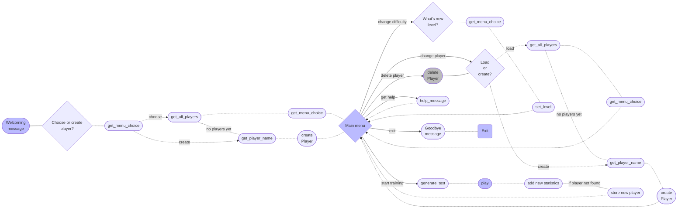

# Game structure  
## Game cycle illustration  
Sketch of our game workflow  

## Code structure  

## Further functionality  
Further functionality might be:  
 - adding delete-user functionality :tired_face:  
 - building web-interface wrapping
 - moving database from plain-text storage to real databases (like SQL)
 - in-building more STL for optimality  
 - anything you might think of: from live clock to key-specific statistics :ok_hand:
